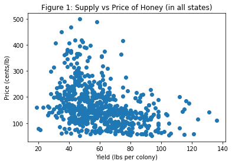
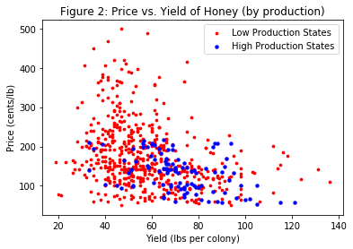
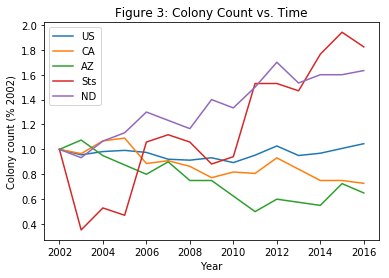

## US Apiculture and Honey Production - Data Science
(name will probably be changed later)

### Matt and Sean
(it's like the band Matt and Kim, except that instead of producing songs like "Daylight" and "Cameras", we made a data science project about bees.)

Q:
Our primary goal is to explore state-based, economic, or time-based trends in American apiculture. In particular, we test several intuitive hypotheses, like the basic relationship between production and commodity prices or the colony counts in states over collapse-heavy years; our goal is both to verify these "common sense" ideas, and to find or highlight cases in which this subjective evaluation does _not_ hold.

To do so, we use data from the USDA's National Agricultural Statistics Service's survey of [bees and honey production](https://www.nass.usda.gov/Surveys/Guide_to_NASS_Surveys/Bee_and_Honey/).

M:
Our methods begin with the collection, collation, and sanitization of the USDA data, from baselines of varying-formatted CSVs into groupings of production data by state and year. Once we have the data in an easily-manipulable format, we then test a variety of correlations (e.g., through `corr_all` in our source). 

RI: [todo: split up]

Figure 1 illustrates that there is a definite, negative correlation between a state's yield (in pounds of honey per colony) and the price-per-pound - perhaps because higher yield suggests higher overall supplies, which in turn corresponds to lower prices (assuming stable demand), buffered by the numerous other sources in similar markets. This correlation of -0.36, however, can be broken down further:

Figure 2 shows the same graph as figure 1, with a demarcation for "high-production" states (e.g., ND, CA) in blue. The correlation for these high-producers is -.41, compared to the -.3 for lower-production states. This is likely attributable to the fact that states with a higher absolute yield exert a disproportionate influence on the overall supply and demand of honey, coupled with potential agricultural and weather patterns which would affect multiple high-producers across the board. Of note, states with above-average production have far fewer outliers, especially with high mean prices or low production.

Figure 3 plots the colony counts in states, as a percentage of their "starting" counts in 2002 (the first year in our sanitized datasets). US refers to the nation as a whole, displaying a small downtick in the 2000s and a slight recovery in the early 2010s; however, agriculturally-focused states (e.g. CA, AZ) have a more lasting decline in honey-producing colonies, while honey-crop states and small states (Sts - states too small to provide specific data for, due to privacy constraints) had early drops followed by rapid (albeit highly variable) expansions. 