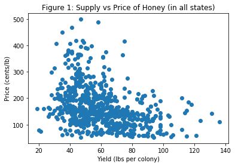
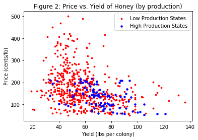
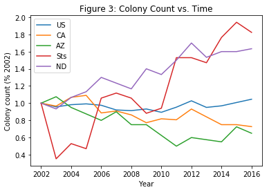
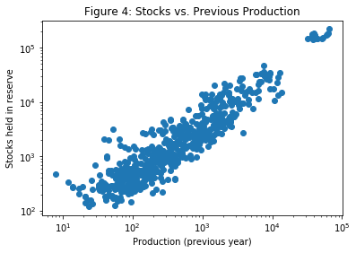
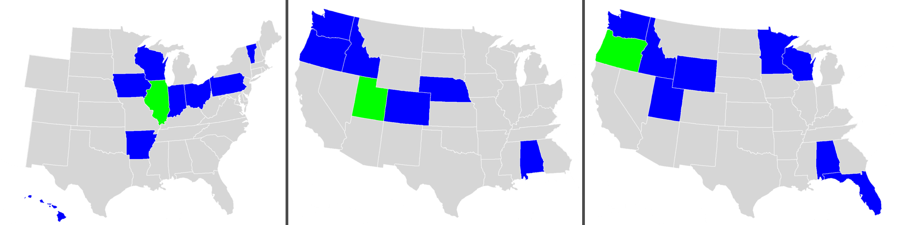

## US Apiculture and Honey Production

### Matthew Ruehle and Sean Carter

##### Motivation:
Our primary goal is to identify state-based, economic, or time-based patterns in American apiculture. In particular, we test several intuitive hypotheses, like the basic relationship between production and commodity prices or the colony counts in states over collapse-heavy years; our goal is both to verify these "common sense" ideas, and to find or highlight cases in which this subjective evaluation does _not_ hold.

To do so, we use data from the USDA's National Agricultural Statistics Service's survey of [bees and honey production](https://www.nass.usda.gov/Surveys/Guide_to_NASS_Surveys/Bee_and_Honey/).

---

##### Tools:
Our methods begin with the collection, collation, and sanitization of the USDA data, from baselines of varying-formatted CSVs into groupings of production data by state and year. Once we have the data in an easily-manipulable format, we then test a variety of correlations (e.g., through `corr_all` in our jupyter source notebook).

##### Production and Prices:

One basic assumption that is is easy to make about most agricultural products is that the supply is closely related to prices.

**Figure 1** illustrates that there is a definite, negative correlation between a state's yield (in pounds of honey per colony) and the price-per-pound - perhaps because higher yield suggests higher overall supplies, which in turn corresponds to lower prices (assuming stable demand), buffered by the numerous other sources in similar markets. This correlation of -0.36, however, can be refined further.

**Figure 2** shows the same graph data as figure 1, with a demarcation for "high-production" states (e.g., ND, CA) in blue. The correlation for these high-producers is -.41, compared to the -.3 for lower-production states. This is likely attributable to the fact that states with a higher absolute yield exert a disproportionate influence on the overall supply and demand of honey, coupled with potential agricultural and weather patterns which would affect multiple high-producers across the board. Of note, states with above-average production have far fewer outliers, especially with high mean prices or low production.

---

##### Colony Survival

One common concern about honey production is the collapse of some colonies.

**Figure 3** plots the colony counts in states, as a percentage of their "starting" counts in 2002 (the first year in our sanitized datasets). US refers to the nation as a whole, displaying a small downtick in the 2000s and a slight recovery in the early 2010s; however, agriculturally-focused states (e.g. CA, AZ) have a more lasting decline in honey-producing colonies, while honey-crop states and small states (Sts - states too small to provide specific data for, due to privacy constraints) had early drops followed by rapid (albeit highly variable) expansions.

---

##### Honey Reserves:

One decision that can impact honey markets is whether producers sell most of the honey produced in a year, or whether some of it is held in reserve to keep the market stable in both current and future years.

**Figure 4** illustrates the strong positive correlation between a state's absolute production in a previous year, and the absolute quantity of honey in reserves or stocks. This conforms to our expectation that states which produce more honey will also keep more in reserve, especially during particularly-high-production years; the outliers to the right are production data for the US as a whole, indicating the trend holds at that scale as well.

---

##### Regional Ties:

**Figures 5-7** show the "clustering" of productions which we observe in many states. By calculating the cross-correlation between all pairs of states, we can see trends - groups whose production tends to move together. The state in green - Illinois, Oregon, and Utah respectively - is most closely correlated to the states in blue. Most of these include neighbors and states with similar climes; coincidence or random noise, however, may be the cause for factors like the correlation between Oregon and Alabama, or that of Illinois and Hawaii.

---

Source code: [report2.ipynb](../report2.ipynb)
